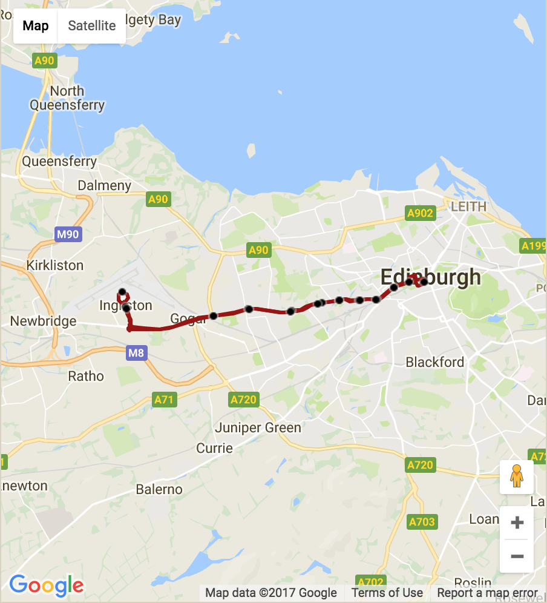
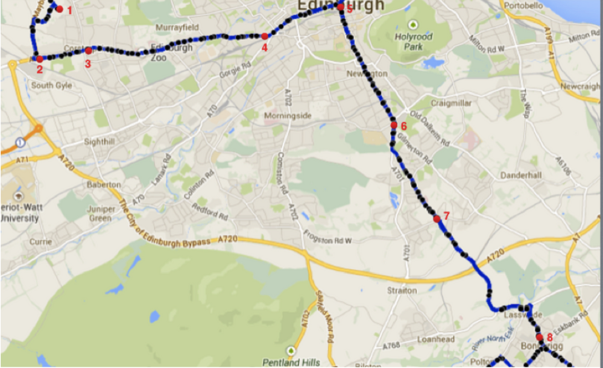
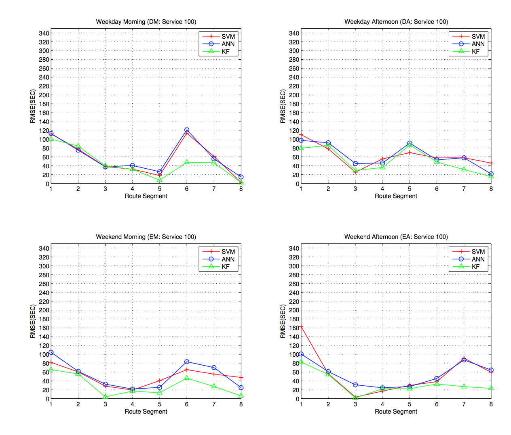
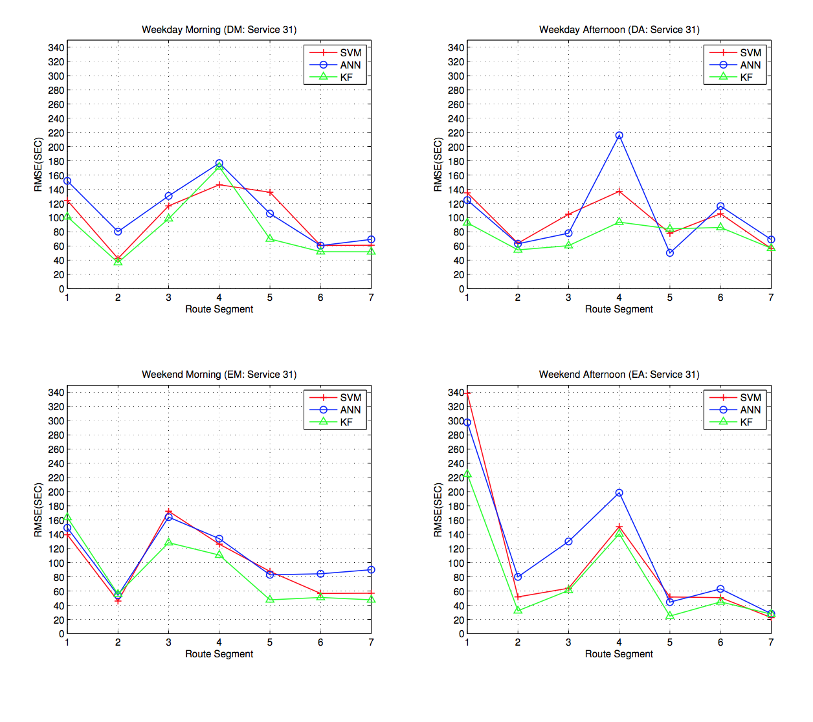

In the project, three types of models, Support Vector Machine (SVM), Artificial Neural Network (ANN) and Kalman
Filtering (KF), are constructed to predict the travel time of service 31 and service 100
in Edinburgh using the available data collected from the [Bustracker](http://www.mybustracker.co.uk/) website.

##### service 100

##### service 31

Restricted to limited information, I used features: 
- “driving skill” - represented by labeled two routes (100/31)
- “road conditon” - represented by the its segment number
- “bus condition” - its travel time in last road segment
- “traffic condition” - previous bus’ travel time in this road segment
- “time/day/week” - four patterns (weekday/weekend+morning/afternoon)

And results of the three models look like:

